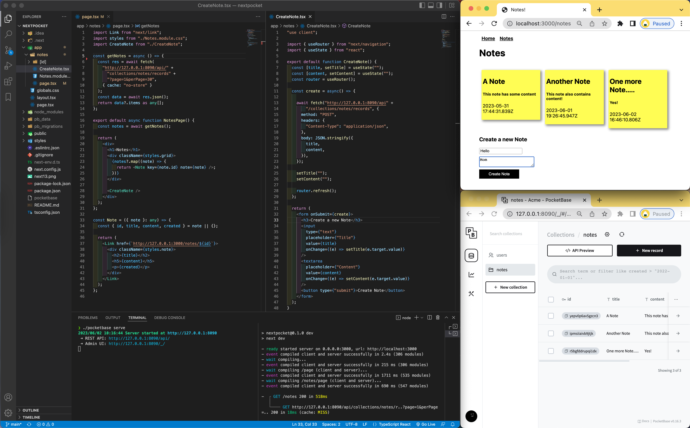

# Next 13 Notes App

A simple CRUD app that employs `pocketbase` as its backend, demonstrates some new features of Next 13 including 
 - Routing
 - Layout, Error and Loading Components
 - "use client"; directive
 - Style Modules
 - Client vs. Server data fetching
 - streaming w/ React's Suspence protocol



### Setup

1. Create a new Next.js app:
`npx create-next-app@latest --ts`

2. Download Pocketbase from [pocketbase.io](pocketbase.io)
3. Navigate to the unzipped directory
`cd pocketbase_0.7.9_darwin_arm64`
4. Start Pocketbase:
`./pocketbase serve`
5. Open the [Admin UI](http://127.0.0.1:8090/_/), create collection, and update security rules to allow read/write access. 
6. run the development server:

```bash
npm run dev
```

